# OCR:
.
In this project, I created an android app that can recognize text in images from / either existing images or new images taken from the camera - a form of Optical Character Recognition (OCR). Further, It can also scan different barcode/QR code formats and give the raw data and format type to be used. It accomplishes these tasks by incorporating the Google ML Kit SDK. 

  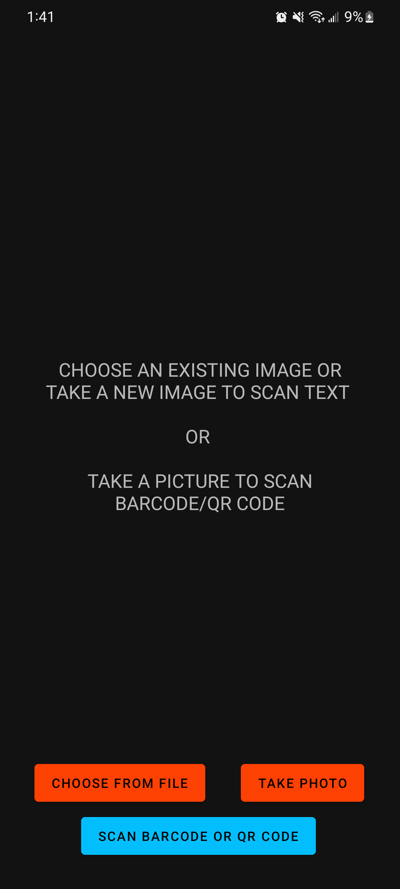
  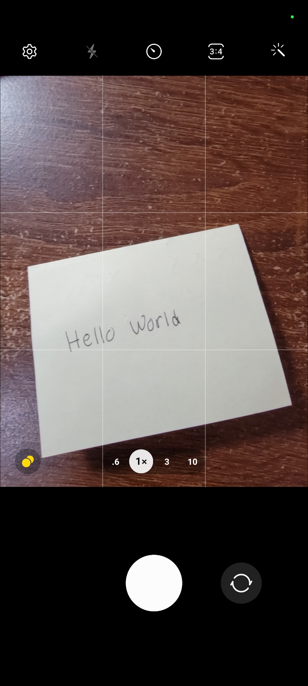
  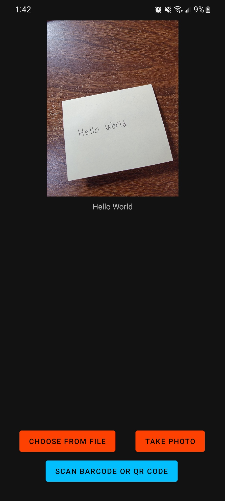
  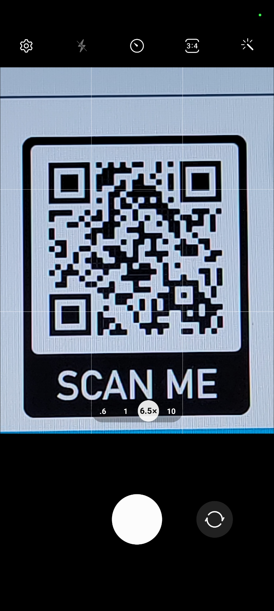
  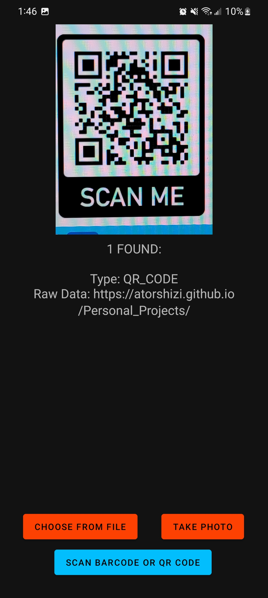
  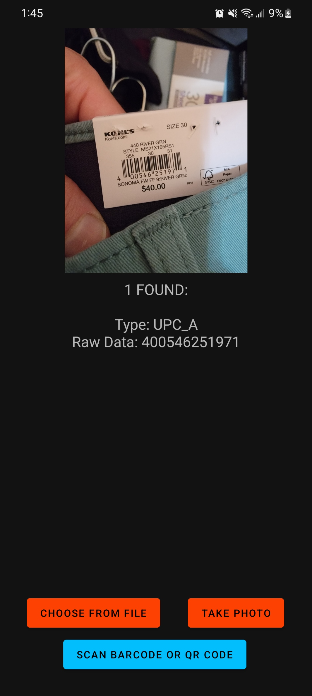
 

 
Above, we can see the startup page of the app, as well as a demo in which the user takes a picture a sentence in the app and the sentence is then processed and shown below the image taken in the app in text form (image 3). It also shows a demo in which a barcode/QR code is scanned and the respective value is then given to the user.

### The main code and apk can be found at the below links:

#### MainActivity.java
[app/src/main/java/com/example/ocr/MainActivity.java](https://github.com/atorshizi/Personal_Projects/blob/main/OCR/app/src/main/java/com/example/ocr/MainActivity.java)

### MainActivity.xml
[app/src/main/res/layout/activity_main.xml](https://github.com/atorshizi/Personal_Projects/blob/main/OCR/app/src/main/res/layout/activity_main.xml)

### .apk file
[app/OCR.apk](https://github.com/atorshizi/Personal_Projects/blob/main/OCR/app/OCR.apk)

# Bowling Score Calculator :
This project is a java program and GUI that interacts with the user to get bowling score frame by frame for a standard game with 10 frames. It can then calculate the game score based on the rules of bowling in which spares double the next score and a strike doubles the next two. 

  
  
  
  
 

 
In the above screenshots we can see the state of the program when it first launched as well two example scores with the correct final scores shown based on the inputs, respectively. In the last image, we see the result of an incorrect/impossible score being inputted and the error message that is shown as a result. 

### The main code and apk can be found at the below links:

#### [Score Finder.java](https://github.com/atorshizi/Personal_Projects/blob/main/Score%20Finder/ScoreFinder.java)

#### [Frame.java](https://github.com/atorshizi/Personal_Projects/blob/main/Score%20Finder/Frame.java)

# TicTacToe
This folder contains all of the files used to create an Android app of the classic TicTacToe game; the app shows which player's turn it is and can also determine once a winner/tie has been achieved. 

  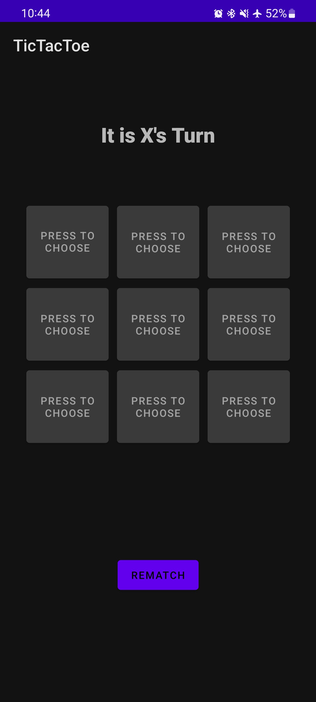
  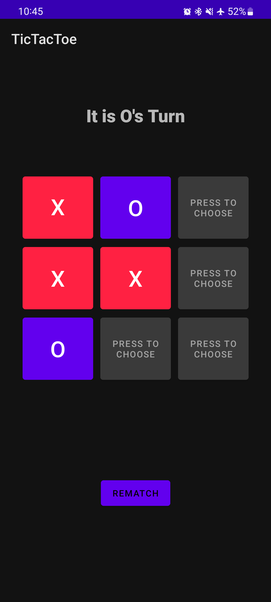
  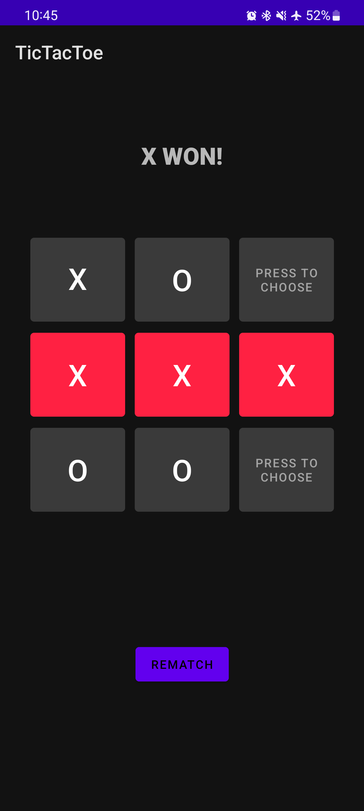
  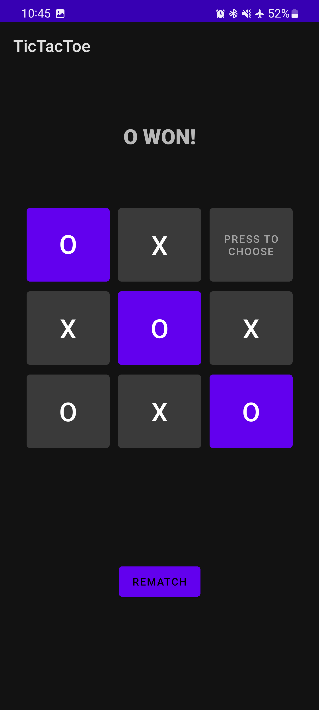
  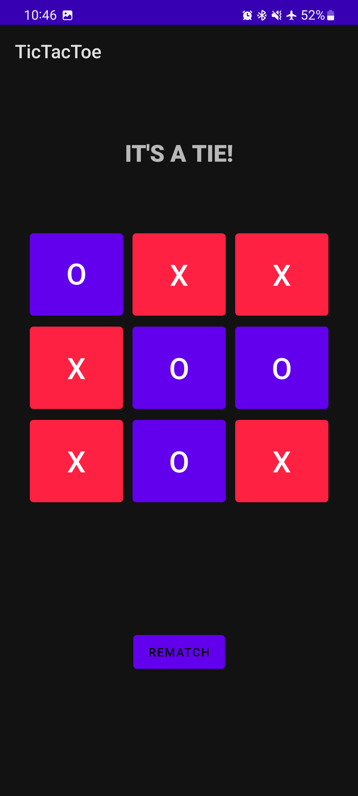
 

 
The images above show a demonstration of the game when it is first started as well as different scenarios in which either player X or player O win the game or if the game ends in a tie. 

#### The main code and apk can be found at the below links:

### MainActivity.java
[app/src/main/java/com/example/MainActivity.java](https://github.com/atorshizi/Personal_Projects/blob/main/TicTacToe/app/src/main/java/com/example/TicTacToe/MainActivity.java)

### MainActivity.xml
[app/src/main/res/layout/activity_main.xml](https://github.com/atorshizi/Personal_Projects/blob/main/TicTacToe/app/src/main/res/layout/activity_main.xml)

### .apk file
[app/TicTacToe.apk](https://github.com/atorshizi/Personal_Projects/blob/main/TicTacToe/app/TicTacToe.apk)

