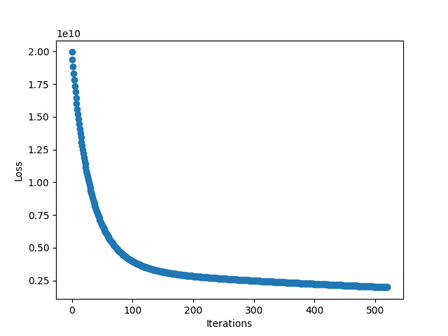
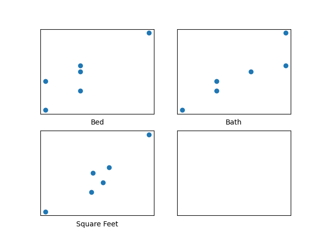
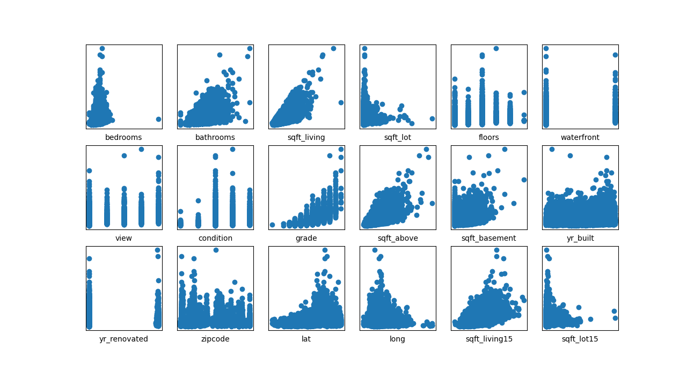
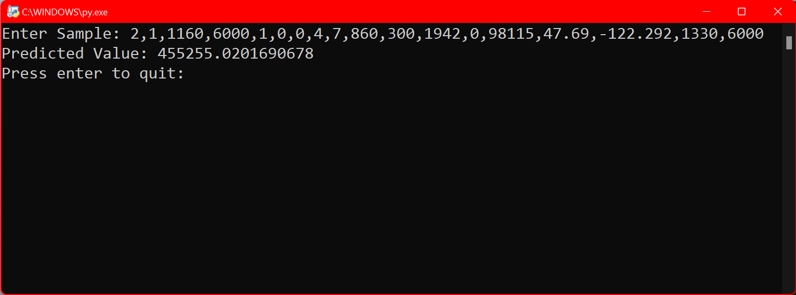

A brief description of each of the 3 projects can be found below as well as links to the code and screenshots.\
Link to each project's section on this page: [OCR](#ocr), [Score Calculator](#score-calculator), [TicTacToe](#tictactoe)

# OCR:
In this project, I created an android app that can recognize text in images from either existing images or from new images that can be taken from the camera directly from the app - this is a form of Optical Character Recognition (OCR). Further, it can also scan one or multiple barcode/QR codes from a single picture and display the raw data and format type - it supports 13 different barcode/QR code formats. It accomplishes these tasks by incorporating the Google ML Kit SDK. 

  
  
  
  
  
  
 

 
Above, we can see the startup page of the app, as well as a demo in which the user takes a picture a sentence in the app and the sentence is then processed and shown below the image taken in the app in text form (image 3). It also shows a demo in which a single barcode/QR code is scanned and the respective value is then given to the user.

### The main code and apk can be found at the below links:

#### MainActivity.java
[app/src/main/java/com/example/ocr/MainActivity.java](https://github.com/atorshizi/Personal_Projects/blob/main/OCR/app/src/main/java/com/example/ocr/MainActivity.java)

### MainActivity.xml
[app/src/main/res/layout/activity_main.xml](https://github.com/atorshizi/Personal_Projects/blob/main/OCR/app/src/main/res/layout/activity_main.xml)

### .apk file
[app/OCR.apk](https://github.com/atorshizi/Personal_Projects/blob/main/OCR/app/OCR.apk)

# Regression:
This is an implementation of a regression program - a form of supervised machine learning - that can handle datasets with multiple features. There are two main files within it: Custom_BGD_Regression and SKL_Regression. The custom implementation minimizes the squared-error cost function using batch gradient descent. It processes a .csv file to use as the training data and allows users to change the default values of the learning rate, maximum number of iterations of the gradient descent, and the epsilon value that is used to determine the convergence of the gradient descent. Once trained, the developed model can be used to predict values for other examples. Using matplotlib, plots of the learning curve and individual features can be shown. The second file, SKL_Regression, is a roughly functionally equivalent program using stochastic gradient descent which was developed using scikit_learn specifically, the SGDRegressor. Further specifications on program methods and .csv formatting are commented in the program files. There is an included tester file which is used to test various methods of both programs.

  
  
  
  
 

 
The screenshots show an example of a learning curve that was given using the BGD program in the first screenshot as well as plots of different datasets' features vs. the true output as given in the training data - one set has 3 features and the other has 18 - to be used to visualize trends. An example of how to interact with the program through the command line in shown in the fourth screenshot. In all of these scenarios, housing data was used to predict prices. 

### The main code and apk can be found at the below links:

#### Custom_BGD_Regression.py
[app/src/main/java/com/example/ocr/MainActivity.java](https://github.com/atorshizi/Personal_Projects/blob/main/Regression/Custom_BGD_Regression.py)

### SKL_Regression.py
[app/src/main/res/layout/activity_main.xml](https://github.com/atorshizi/Personal_Projects/blob/main/Regression/SKL_Regression.py)

# Score Calculator:
This project draws on the Java swing toolkit to create a Java program and GUI that interacts with the user to get bowling score frame by frame for a standard game with 10 frames. It can then calculate the game score based on the rules of bowling in which spares double the next score and a strike doubles the next two. 

  
  
  
  

 
In the above screenshots we can see the state of the program when it first launched as well two example scores with the correct final scores shown based on the inputs, respectively. In the last image, we see the result of an incorrect/impossible score being inputted and the error message that is shown as a result - this is because of the score of 11 being inputted in the last frame which is not possible in a standard game of bowling. 

### The main code and apk can be found at the below links:

#### [Score Finder.java](https://github.com/atorshizi/Personal_Projects/blob/main/Score%20Finder/ScoreFinder.java)

#### [Frame.java](https://github.com/atorshizi/Personal_Projects/blob/main/Score%20Finder/Frame.java)

# TicTacToe:
This folder contains all of the files used to create an Android app of the classic TicTacToe game; the app shows which player's turn it is and can also determine once a winner/tie has been achieved. 

  
  
  
  
  
 

 
The images above show a demonstration of the game when it is first started as well as different scenarios in which either player X or player O win the game or if the game ends in a tie. 

### The main code and apk can be found at the below links:

### MainActivity.java
[app/src/main/java/com/example/MainActivity.java](https://github.com/atorshizi/Personal_Projects/blob/main/TicTacToe/app/src/main/java/com/example/TicTacToe/MainActivity.java)

### MainActivity.xml
[app/src/main/res/layout/activity_main.xml](https://github.com/atorshizi/Personal_Projects/blob/main/TicTacToe/app/src/main/res/layout/activity_main.xml)

### .apk file
[app/TicTacToe.apk](https://github.com/atorshizi/Personal_Projects/blob/main/TicTacToe/app/TicTacToe.apk)

