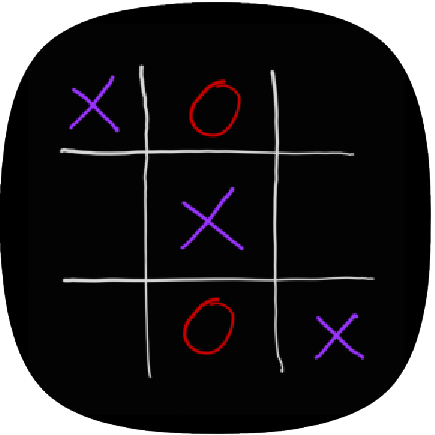

This repository contains the personal coding projects I have completed. A brief description of each project can be found below.

# TicTacToe:
This folder contains all of the files used to create an Android app of the classic TicTacToe game. 

  
  
  
  
  
 

The main code can be found at the below links.

### MainActivity.java
[app/src/main/java/com/example/MainActivity.java](https://github.com/atorshizi/Personal_Projects/blob/main/TicTacToe/app/src/main/java/com/example/TicTacToe/MainActivity.java)

### MainActivity.xml
[app/src/main/res/layout/activity_main.xml](https://github.com/atorshizi/Personal_Projects/blob/main/TicTacToe/app/src/main/res/layout/activity_main.xml)

### .apk file
[app/TicTacToe.apk](https://github.com/atorshizi/Personal_Projects/blob/main/TicTacToe/app/TicTacToe.apk)

# OCR:
This folder contains all of the files that was used to create an android app that incorporates the Google ML Kit and can recognize text in images from / either existing images or new images taken from the camera - Optical Character Recognition (OCR). It can also scan different barcode/QR code formats and give the raw data and format type to the user. The main code can be found at the below links.

### MainActivity.java
[app/src/main/java/com/example/ocr/MainActivity.java](https://github.com/atorshizi/Personal_Projects/blob/main/OCR/app/src/main/java/com/example/ocr/MainActivity.java)

### MainActivity.xml
[app/src/main/res/layout/activity_main.xml](https://github.com/atorshizi/Personal_Projects/blob/main/OCR/app/src/main/res/layout/activity_main.xml)

### .apk file
[app/OCR.apk](https://github.com/atorshizi/Personal_Projects/blob/main/OCR/app/OCR.apk)
